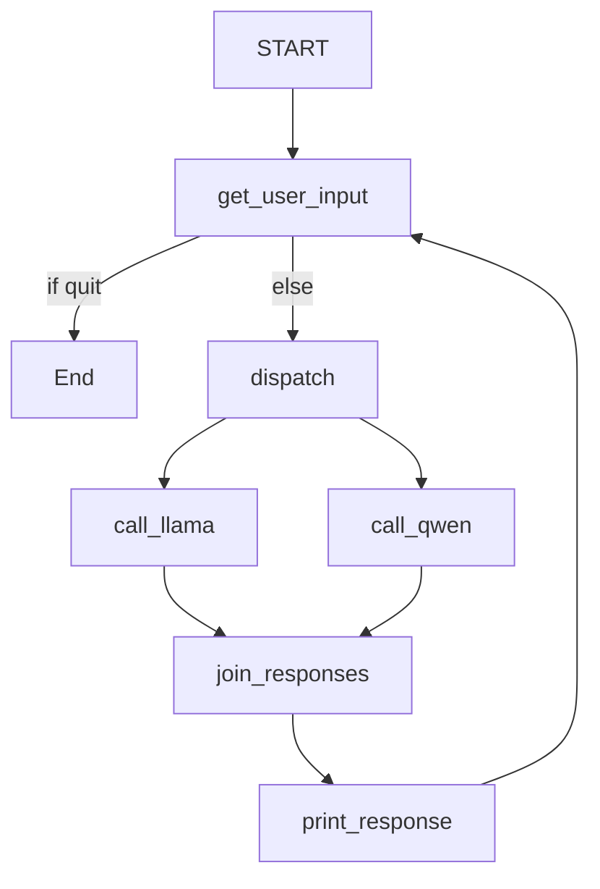

# Mermaid Diagram: LangGraph Agent System

This diagram shows the flow of nodes and edges in the LangGraph agent system, including user input, model calls, response joining, and looping with checkpointing.
